# Breathalyzer

Our team has developed a breathalyzer capable of converting a physiological signal (BrAC) to Blood Alcohol Concentration (BAC) for monitoring purposes. This monitoring is achieved through our mobile application, DrinkÉ, which utilizes Firebase. Additionally, we have incorporated 3D printing for some components of our product, making our breathalyzer relatively portable.

  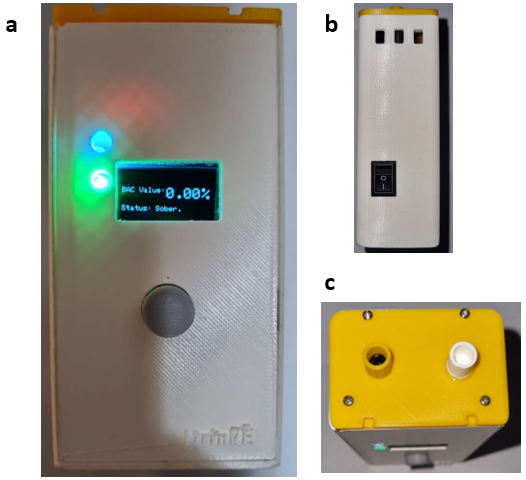
  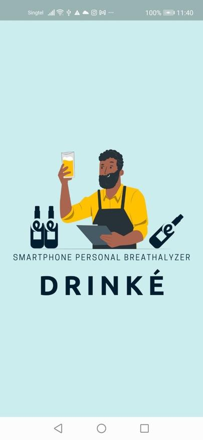

---

### Splash Screens

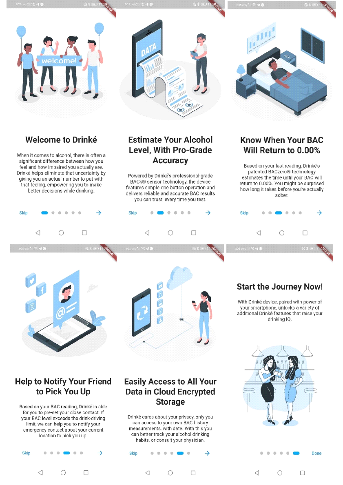

Upon launching the application, a splash screen (Fig 6.2) will be displayed to indicate the
loading progress of the application. It was designed with a graphical control element consisting
of ‘DrinkÉ’ window containing an image and logo. For first-time users, there will then be a brief
introduction of our application features (Fig 6.3) as well as to explain our application to them.
The introduction screen was programmed such that it will not displayed again after user had
create an account.

---

### Sign In & Sign Up Screens

  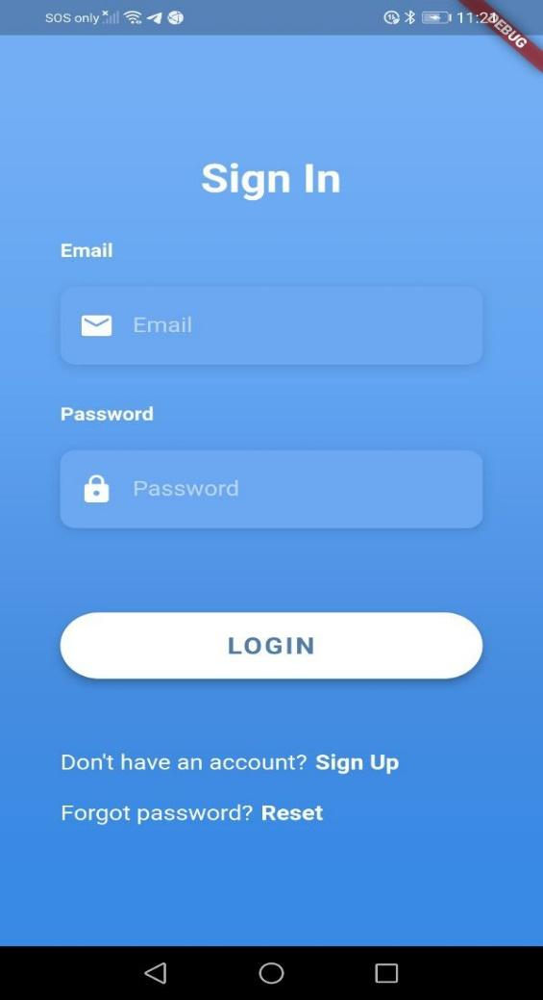
  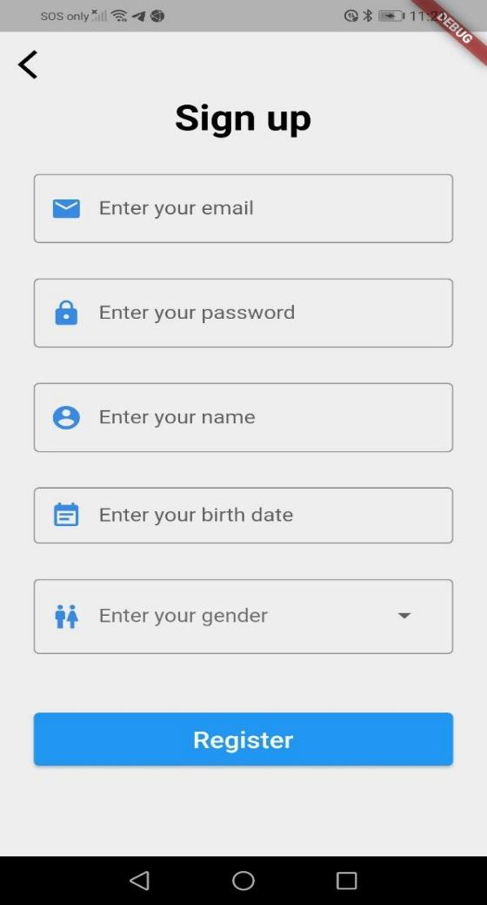

The user will then see the sign in page (Figure 6.4). This page will allow the users to either
register a new account or sign in with an existing account using their email address and
password. All the user authentications are stored encrypted in the Firebase cloud storage. For
users who want to register a new account, they can click on the ‘Sign Up’ button, and they will
be directed to the sign-up page (Figure 6.4), for them to key in their personal details, such as
email address, password, name, date of birth and gender.

---

### Forgot Password

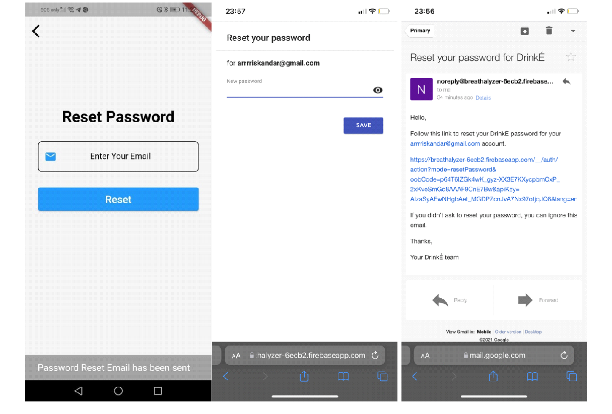

For users who have forgotten their password, they can click on the ‘Reset’ button, and they will
be directed to the reset password page where they can key in their email address (Figure 6.5a).
From Firebase, they will then receive the password reset email (Figure 6.5c), and by following
the link, they will be able to reset their password (Figure 6.5b). In the future, we hope to add in a
“Remember Me” feature for the sign-in page so that users will be signed in automatically next
time.

---

### Home Screen

  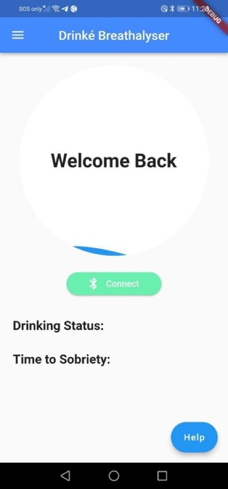
  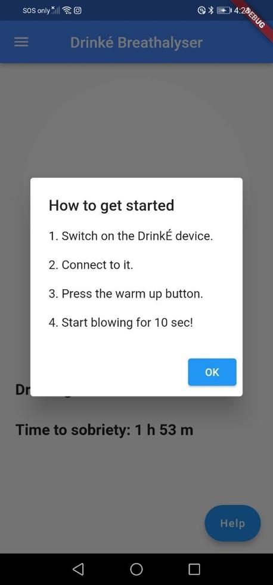
  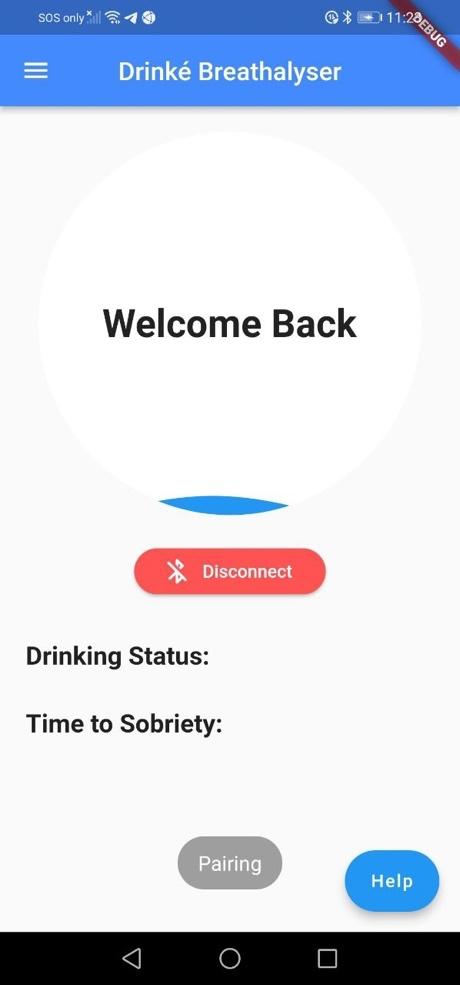

  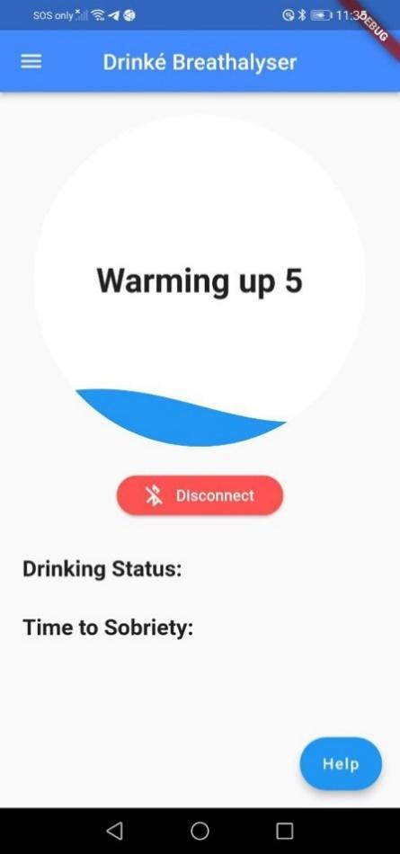
  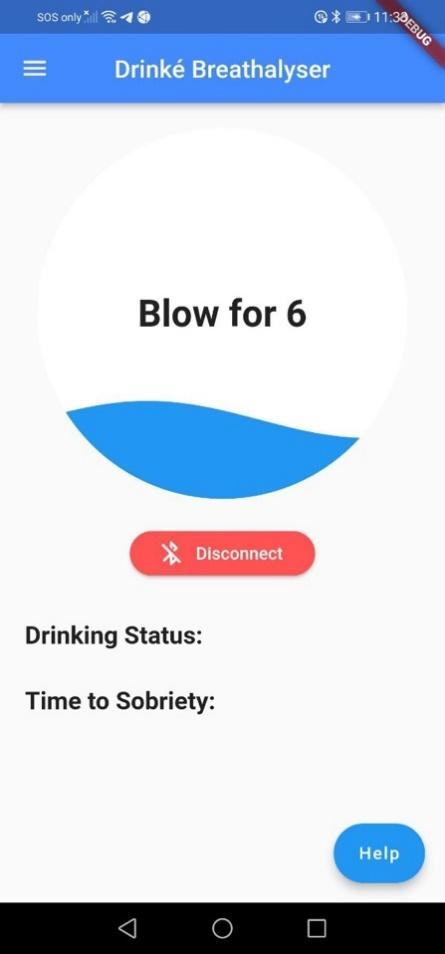

  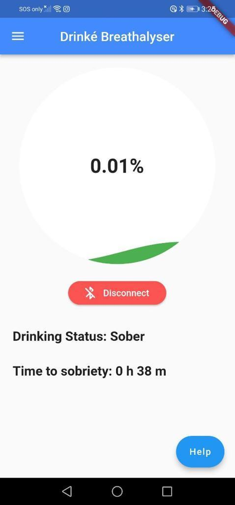
  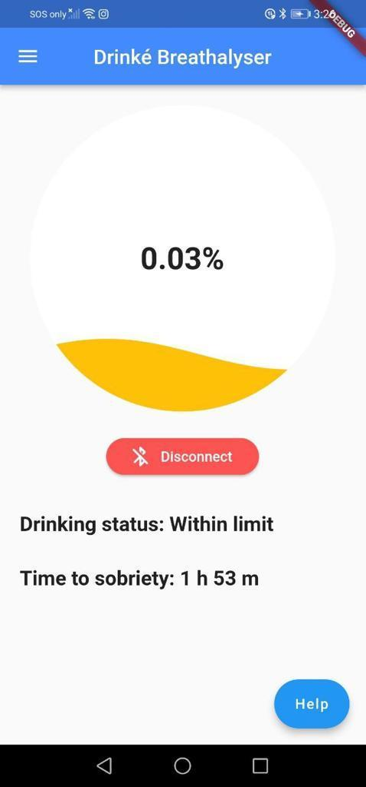
  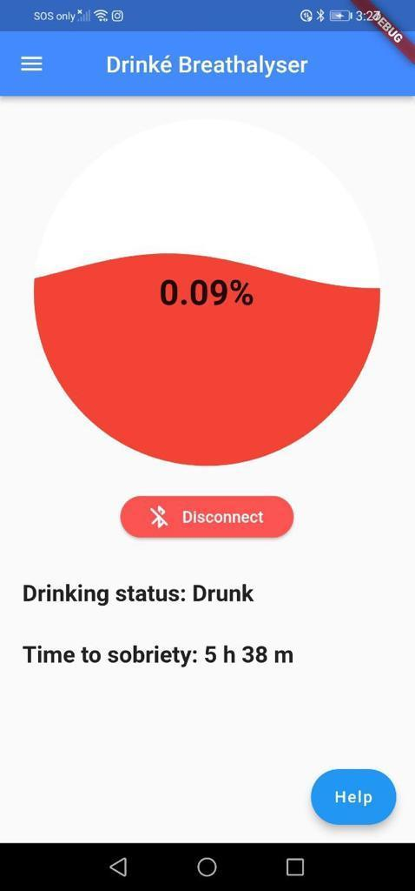

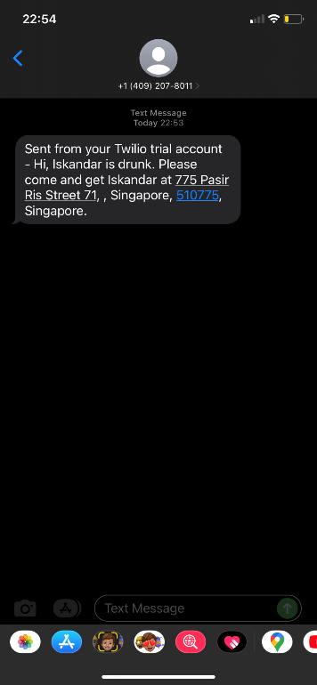

---

### Profile Screen

  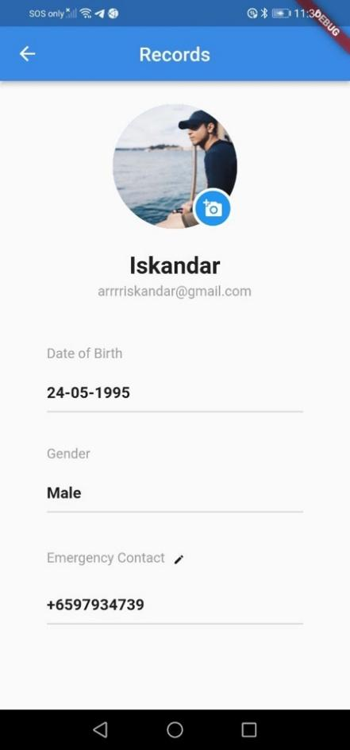
  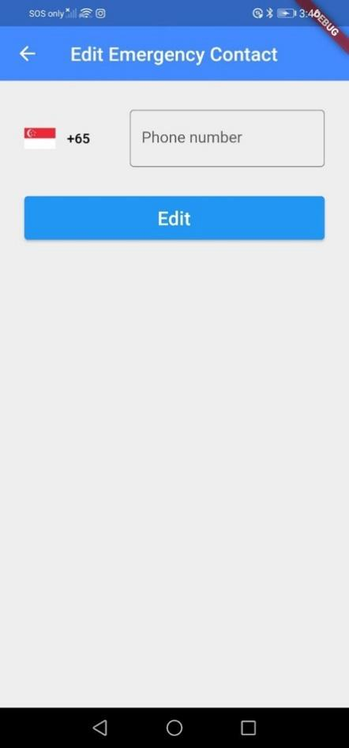
  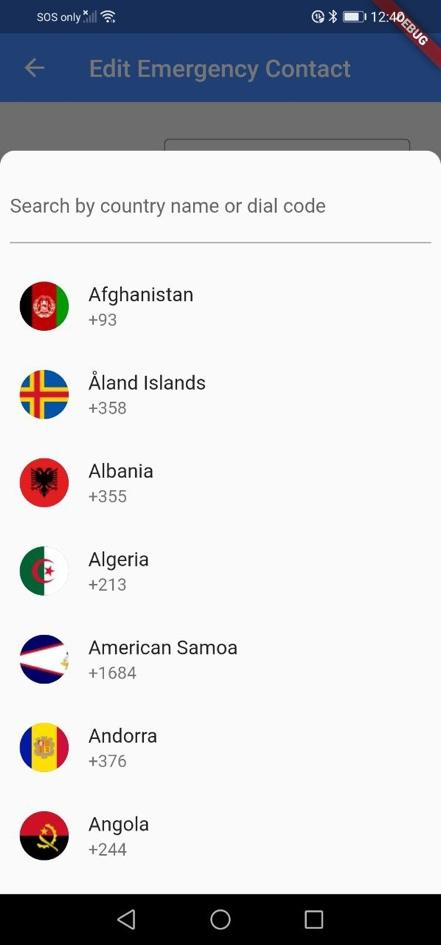

---

### Records Screen

---

### Learn More Screen

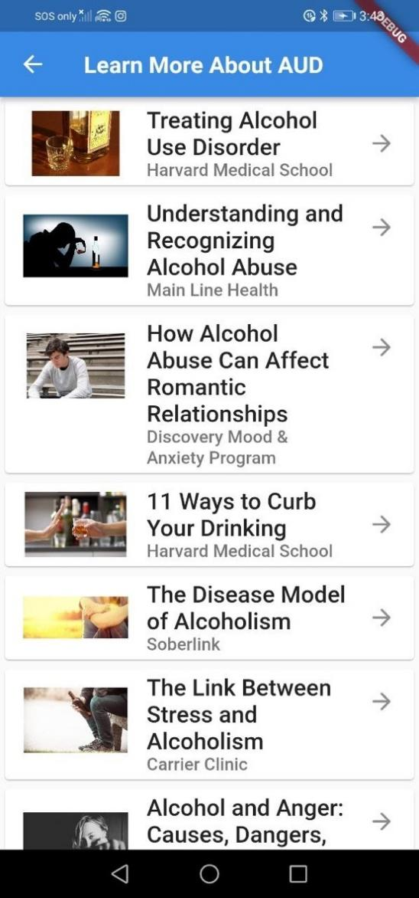

---

### Donate Us Screen

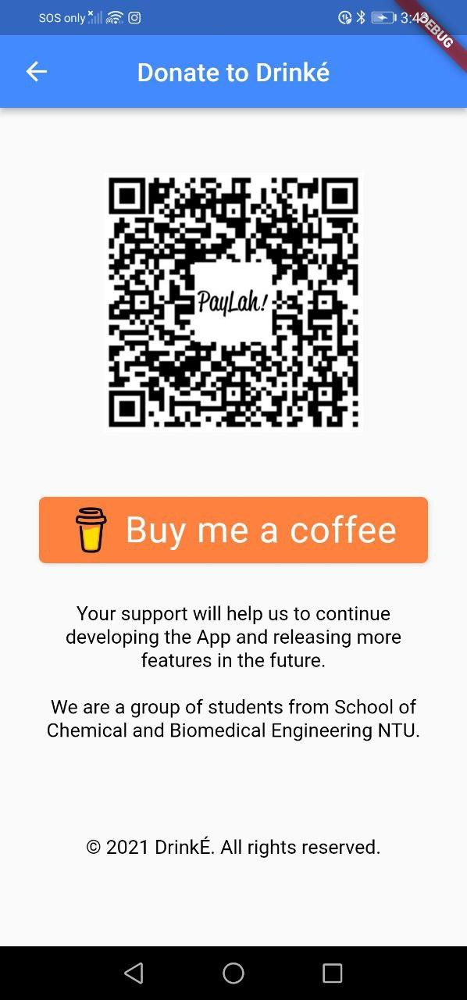

---

### Smart Schduling Screen

  
  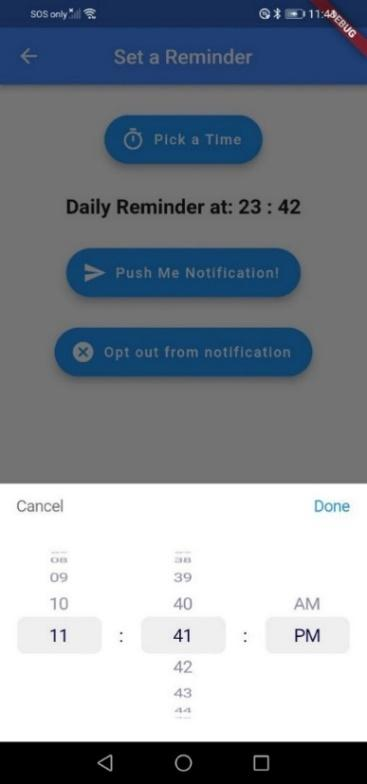
  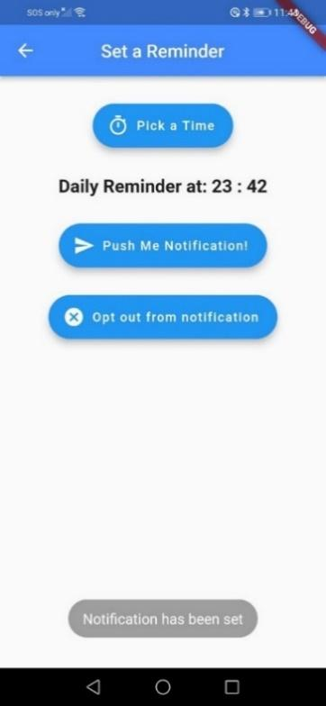
  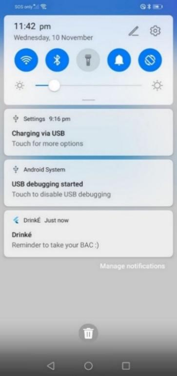

---
