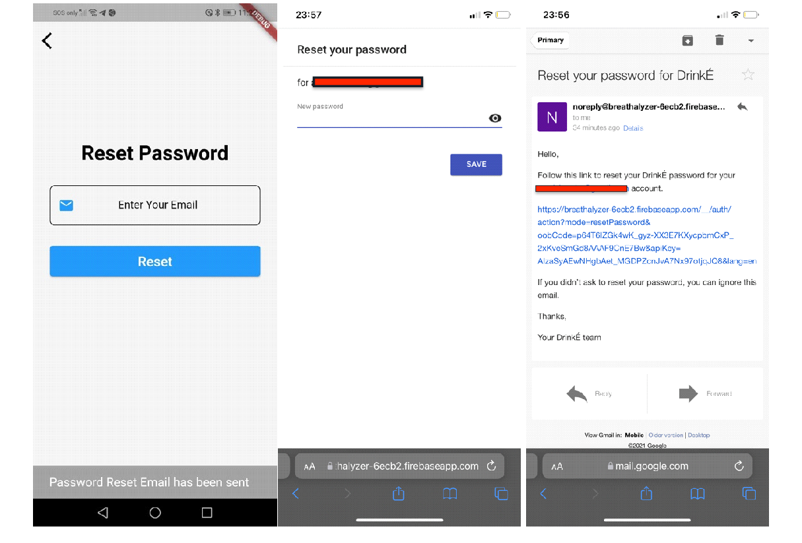
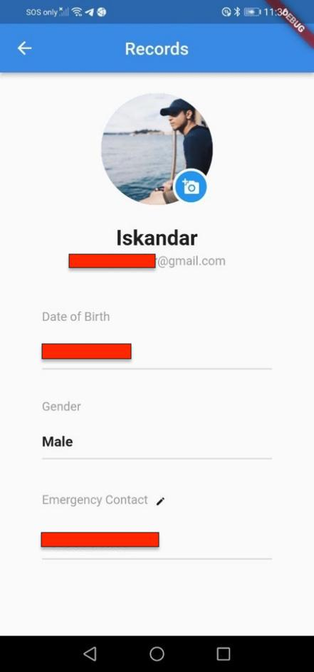
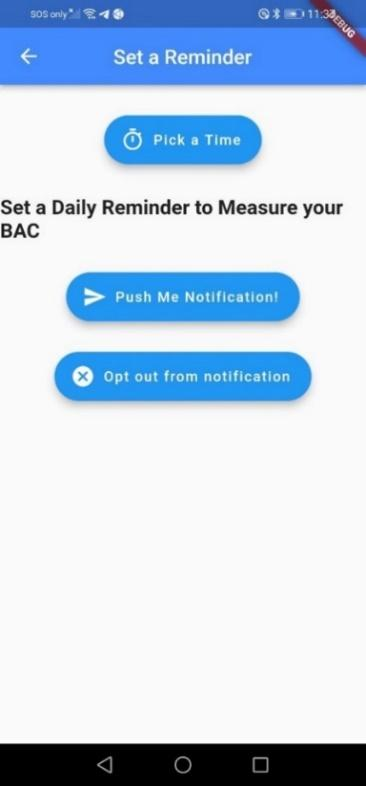

# Breathalyzer

  
  

Our team has developed a breathalyzer capable of converting a physiological signal (BrAC) to Blood Alcohol Concentration (BAC) for monitoring purposes. This monitoring is achieved through our mobile application, DrinkÉ, which utilizes Firebase. Additionally, we have incorporated 3D printing for some components of our product, making our breathalyzer relatively portable.

---

### Onboarding Screens

For first-time users, there will then be a brief introduction of our application's features, as well as an explanation of our application. The introduction screen will not be displayed again after the user has created an account.

---

### Sign In, Sign Up & Forgot Password Screens

The user will then see the sign-in page. This page will allow users to either register a new account or sign in with an existing account using their email address and password. All user authentications are stored encrypted in Firebase.

For users who want to register a new account, they can click on the 'Sign Up' button and will be directed to the sign-up page. Here, they can enter their personal details such as email address, password, name, date of birth, and gender.

For users who have forgotten their password, they can click on the 'Reset' button and will be directed to the reset password page, where they can enter their email address. From Firebase, they will then receive the password reset email, and by following the link, they will be able to reset their password.

---

### Home Screen

  
  
  

After successfully signing in, users will be directed to our home page, where they can press the "Help" button. This will trigger a pop-up message containing instructions on how they can proceed.

During the initial setup, users are required to configure the device with a PIN code, which is specified for the HC-05 module, in the phone settings. This PIN is necessary to establish a successful connection between the phone and the correct breathalyzer device.

Once the device is powered on, users can press the "Connect" button within the application. This action will initiate a search and pairing process between the mobile application and our DrinkÉ breathalyzer device via Bluetooth.

  
  

Upon establishing the connection, the application will sync with the device's process. First, it will display a warming-up message for 20 seconds, indicating that the device is preparing for use. Subsequently, the application will prompt users to blow into the device for 10 seconds.

To enhance user experience and provide immediate feedback, a countdown visual display will be integrated, reducing users' uncertainty and offering real-time updates on the ongoing process.

  
  
  

After users have blown into the device, their BAC values will be accurately displayed on the interface. Additionally, the drinking status will be classified and shown on the home screen. This information will be accompanied by the suggested time required to reach sobriety, which represents the time needed for the BAC to reach 0.

The DrinkÉ application has implemented a location tracking function. This feature operates by alerting the user's designated emergency contact number when their BAC value exceeds 0.08% while using the breathalyzer and the application. The emergency contact will be notified when the user is considered drunk and may attend to them if necessary.

A user with a recorded BAC value of 0.09% using our breathalyzer will be classified as "Drunk" by the DrinkÉ application. Subsequently, an automatic SMS will be sent through the Twilio service to the user's appointed emergency contact. This message will inform the emergency contact that the user is drunk, along with the user's current location.

The DrinkÉ application utilizes the built-in GPS function of smartphones and the Geolocator plugin to access and retrieve the user's location. Through the Geocoding plugin, the user's coordinates (latitude and longitude) are converted into placemarks, allowing for a more specific display of the user's location. This includes details such as the country, locality, sublocality, street, and postal code, among others.

---

### Profile Screen

  
  
  

In the "User Profile" page, users can view and manage their personal information, including their name, email address, date of birth, gender, and emergency contact. They have the option to upload a profile photo from their local photo storage. Upon granting access to the mobile application, the image pathway is stored and synced into the Firestore cloud. This ensures that the photo will be automatically loaded when the application runs next time.

Additionally, users can change their emergency contact by clicking the pen icon. Here, they can edit the emergency contact number with the assistance of a feature that allows searching for country names or dial codes. This functionality is achieved using the "intl_phone_number_input" package, which simplifies the inputting of phone numbers in international format.

---

### Records Screen

A "Records" page has been set up in our mobile application to store and record previous BAC values. This enables users to track their past BAC values at any time. The BAC values are displayed in descending order, with the most recent recording shown first. This functionality was achieved using the "stream builder" widget, which listens to the Firestore cloud and provides the latest snapshot of queried data.

To ensure data integrity, users are not allowed to modify or delete their past records. This feature can be utilized by patients' therapists to monitor their recovery progress and provide appropriate interventions. In addition to BAC, users can access other details recorded at the time of the record, such as drinking status.

To provide a more intuitive way to visualize the past drinking status at a glance, the color of the liquor icon is programmed to correspond to three colors (green, yellow, and red) based on the drinking status (sober, within limit, and drunk) respectively.

---

### Learn More Screen

We have set up a "Learn" page in our mobile application to expand its functionality beyond tracking and recording BAC values for AUD patients. This "Learn" page contains articles for AUD patients to read and gain a deeper understanding of the disease and the psychology behind drinking. It serves as a constant reminder for AUD patients to continue their journey of recovery and provides valuable knowledge for general users as well.

---

### Smart Schduling Screen

  
  
  
  

A smart scheduling feature is integrated into our mobile application. Users are able to set a daily reminder for their alcohol test, should they wish to do so, through this feature. Users will need to set a desired time for the alcohol test, and the reminder will be visible in the phone's notification bar when they are due for an alcohol test. Users can also opt out of the smart scheduling feature at any time.

---
### Donate Us Screen

We have set up a "Donate" page in our mobile application, which is linked to our PayLah! account. This allows users to donate a small amount of money to support us in continuing our work on the mobile application and developing more features in the future.

---
